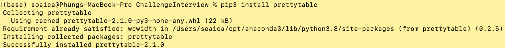
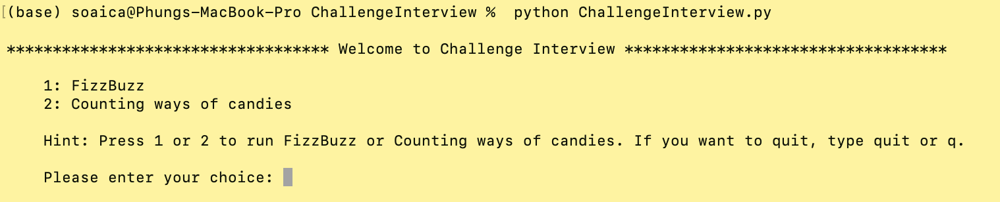
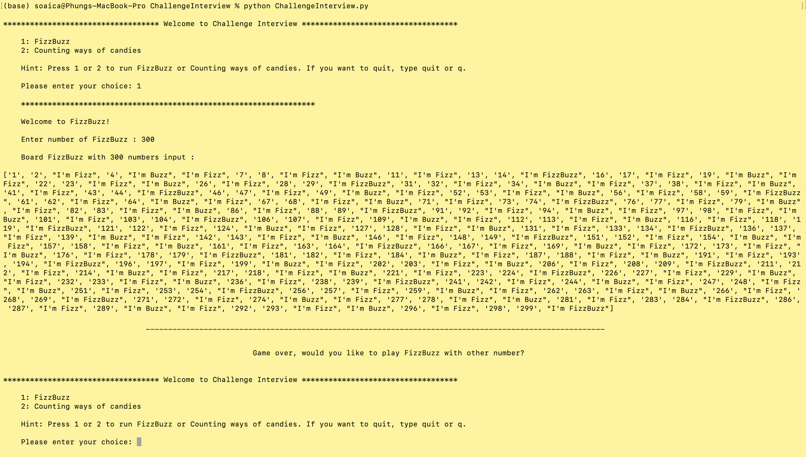
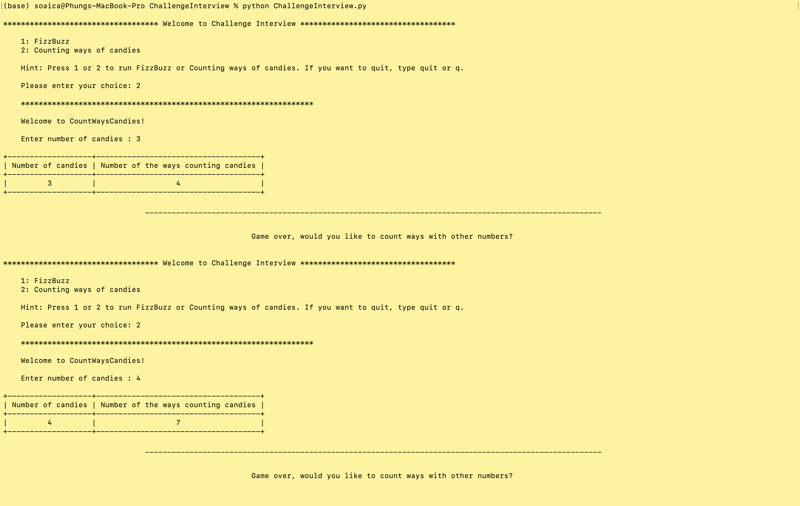
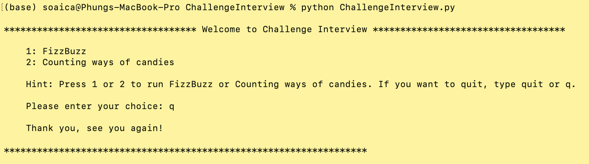

## Introduction 
<br/>
Solve 2 algorithm challenges about FizzBuzz and CountingWaysCandies

## How to run program 

1. Open folder ChallengeInterview

    ```sh
    cd FizzBuzzAndCountWays 
    ```

2. Install prettytable 
   
    ```sh
    pip3 install prettytable
    ```
   
3. Run program ChallengeInterview 

    ```sh
    python fizzBuzzAndCountWays.py
    ```


##Display
1. Install prettytable

2. Start program

3. Run FizzBuzz 

4. Run CountWays 

5. Exit programm 



   
   
   

